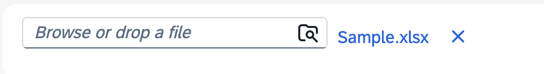
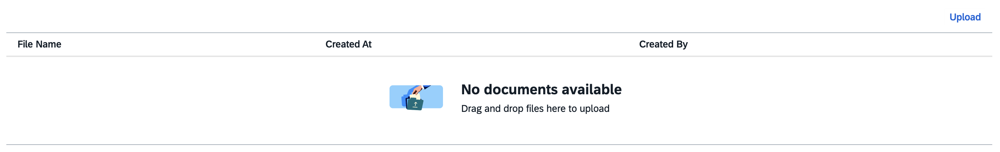
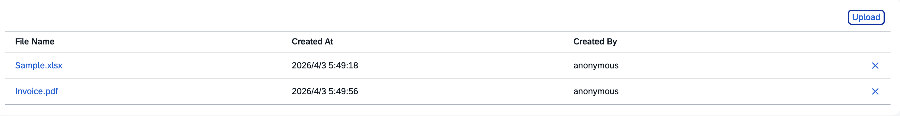
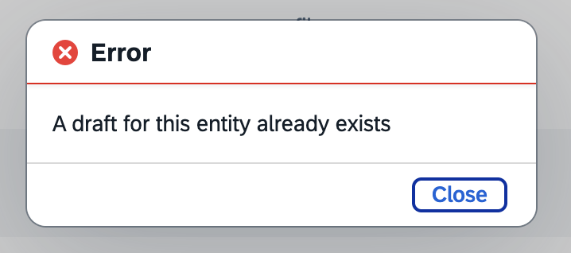

# ui5-upload-controls

Reusable UI5 control library for file upload and download.

**Namespace:** `miyasuta.ui5uploadcontrols`

---

## Controls

### SingleFileUpload

A control for uploading and downloading a **single file** stored as a `LargeBinary` property on an OData entity.

- Displays a file picker. After upload, shows a download link and a delete button.
- Automatically derives the OData service URL and entity path from the binding context — no URL configuration needed.
- Supports both draft-enabled and non-draft entities.



### MultiFileUpload

A control for managing **multiple file attachments** on an OData entity, backed by the `@cap-js/attachments` composition pattern.

- Displays a table of attached files with per-row delete buttons and an upload button in the toolbar. The columns shown between the fixed File Name and Delete columns are controlled by the `displayProperties` property.
- Automatically binds to the attachments navigation property from the parent entity's binding context.
- Supports both draft-enabled and non-draft entities.

**Before upload:**



**After upload:**



---

## Prerequisites

- **Runtime environment**: SAP BTP (HTML5 Application Repository). Other hosting environments are not supported.
- **Backend**: CAP Node.js exposing an OData V4 service. OData V2 and non-CAP backends are not supported. The upload/download logic targets CAP's media stream endpoints (`$value`).
- **UI5 version**: SAPUI5 1.124+ (required for `sap.m.plugins.UploadSetwithTable`). OpenUI5 is not supported.
- **`MultiFileUpload`**: backend entity must expose an `attachments` composition compatible with `@cap-js/attachments`.

---

## Internationalization (i18n)

Error messages (e.g. file type mismatch) are displayed in the user's locale.
The following locales are supported:

| Locale | Language |
|--------|----------|
| `en` (default) | English |
| `de` | German |
| `ja` | Japanese |

---

## Installation

```bash
npm install --save-dev ui5-upload-controls
```

`--save-dev` is correct here. The library is bundled into the consuming app's build output at build time (via `includeDependency` in `ui5-deploy.yaml`), so it is not needed as a runtime dependency. At runtime, the browser loads the library's resources directly from the HTML5 Application Repository alongside the app.

---

## Usage

### SingleFileUpload

Place the control in an XML View or Fragment that is bound to an OData entity. Bind `fileName` to the entity property that stores the file name — the control derives the OData model name and property name from the binding expression automatically.

```xml
<mvc:View
    xmlns:mvc="sap.ui.core.mvc"
    xmlns:upload="miyasuta.ui5uploadcontrols">

    <!-- Default (unnamed) model — Fiori Elements Object Page -->
    <upload:SingleFileUpload
        fileName="{fileName}"
        contentProperty="content" />

</mvc:View>
```

With a named model and automatic draft management:

```xml
<upload:SingleFileUpload
    fileName="{myModel>fileName}"
    contentProperty="content"
    draftOnly="false" />
```

#### Properties

| Property | Type | Default | Description |
|---|---|---|---|
| `fileName` | `string` (binding) | `null` | Bound to the entity property that stores the file name (e.g. `fileName="{myModel>fileName}"`). The binding path is used as the OData property name in PATCH requests; the model name is used to resolve the binding context. Omit the model prefix for the default (unnamed) model: `fileName="{fileName}"` |
| `contentProperty` | `string` | `"content"` | Property name of the `LargeBinary` field |
| `draftOnly` | `boolean` | `true` | When `true`, upload is enabled only while the entity is in draft mode. When `false`, the control manages the draft lifecycle automatically (see [Draft Handling](#draft-handling)) |
| `width` | `sap.ui.core.CSSSize` | `"auto"` | Width of the control |
| `enabled` | `boolean` | `true` | Master switch. When `false`, upload and delete are disabled regardless of draft state |
| `mediaTypes` | `string` | `null` | Comma-separated MIME types allowed (e.g. `"application/pdf,image/png"`). `null` means no restriction |
| `fileTypes` | `string` | `null` | Comma-separated file extensions allowed, leading dots optional (e.g. `"pdf,png"`). `null` means no restriction |

#### File Type Filtering

Use `mediaTypes` and/or `fileTypes` to restrict which files a user can select. Specifying both provides the most robust client-side check.

```xml
<!-- Both properties together — most robust -->
<upload:SingleFileUpload
    fileName="{fileName}"
    contentProperty="content"
    mediaTypes="application/pdf,image/png"
    fileTypes="pdf,png" />

<!-- mediaTypes only — use when a wildcard covers multiple extensions (e.g. all images) -->
<upload:SingleFileUpload
    fileName="{fileName}"
    contentProperty="content"
    mediaTypes="image/*" />

<!-- fileTypes only — use when MIME type is unreliable (varies by OS) -->
<upload:SingleFileUpload
    fileName="{fileName}"
    contentProperty="content"
    fileTypes="pdf,xlsx" />
```

The browser file picker shows only allowed types. Drag & drop is not visually restricted, but the control shows an error dialog and blocks the upload if a dropped file does not match.

---

### MultiFileUpload

Place the control in an XML View or Fragment bound to the parent entity. Bind `attachments` to the navigation property for the attachments composition — the control derives the OData model name and navigation segment from the binding expression automatically.

```xml
<mvc:View
    xmlns:mvc="sap.ui.core.mvc"
    xmlns:upload="miyasuta.ui5uploadcontrols">

    <!-- Default (unnamed) model — navigation property is "attachments" -->
    <upload:MultiFileUpload
        attachments="{attachments}" />

</mvc:View>
```

With a named model, custom navigation property, and automatic draft management:

```xml
<upload:MultiFileUpload
    attachments="{myModel>files}"
    draftOnly="false" />
```

Showing only the MIME type column (no created date / created by):

```xml
<upload:MultiFileUpload
    attachments="{attachments}"
    displayProperties="mimeType" />
```

Showing MIME type and created date in that order:

```xml
<upload:MultiFileUpload
    attachments="{attachments}"
    displayProperties="mimeType,createdAt" />
```

#### Properties

| Property | Type | Default | Description |
|---|---|---|---|
| `attachments` | `object` (binding) | `null` | Bound to the navigation property segment for the attachments composition (e.g. `attachments="{myModel>files}"`). The binding path is used as the OData navigation segment in POST/DELETE requests; the model name is used to resolve the binding context. Omit the model prefix for the default (unnamed) model: `attachments="{attachments}"` |
| `displayProperties` | `string` (comma-separated) | `"createdAt,createdBy"` | Ordered list of attachment property names to display as columns between the fixed File Name column (first) and the Delete column (last). Column headers are resolved from `@Common.Label` annotations in the OData metadata; the raw property name is used as a fallback. Example: `displayProperties="mimeType,createdAt"` |
| `draftOnly` | `boolean` | `true` | When `true`, upload and delete are enabled only while the entity is in draft mode. When `false`, the control manages the draft lifecycle automatically (see [Draft Handling](#draft-handling)) |
| `enabled` | `boolean` | `true` | Master switch. When `false`, upload and delete are disabled regardless of draft state |
| `mediaTypes` | `string` | `null` | Comma-separated MIME types allowed (e.g. `"application/pdf,image/png"`). `null` means no restriction |
| `fileTypes` | `string` | `null` | Comma-separated file extensions allowed, leading dots optional (e.g. `"pdf,png"`). `null` means no restriction |

#### File Type Filtering

Use `mediaTypes` and/or `fileTypes` to restrict which files a user can upload. Specifying both provides the most robust client-side check.

```xml
<!-- Both properties together — most robust -->
<upload:MultiFileUpload
    attachments="{attachments}"
    mediaTypes="application/pdf,image/png"
    fileTypes="pdf,png" />

<!-- mediaTypes only — use when a wildcard covers multiple extensions (e.g. all images) -->
<upload:MultiFileUpload
    attachments="{attachments}"
    mediaTypes="image/*" />

<!-- fileTypes only — use when MIME type is unreliable (varies by OS) -->
<upload:MultiFileUpload
    attachments="{attachments}"
    fileTypes="pdf,xlsx" />
```

The browser file picker shows only allowed types. Drag & drop is not visually restricted, but the control shows an error dialog and blocks the upload if a dropped file does not match. For backend enforcement, annotate the CAP `Attachments` entity with `@Core.AcceptableMediaTypes`.

---

## Draft Handling

Both controls automatically detect draft capability by checking for the `IsActiveEntity` property on the binding context.

| `IsActiveEntity` | `draftOnly` | Behavior |
|---|---|---|
| not present | any | Non-draft entity — upload proceeds directly |
| `false` | any | Entity is in draft (edit) mode — upload proceeds directly |
| `true` | `true` | Entity is active (display mode) — **upload and delete are disabled** |
| `true` | `false` | Entity is active — the control manages the draft lifecycle automatically (see below) |

> **Fiori Elements Object Page**: In the standard case, use `draftOnly="true"` (the default) and let the Object Page manage the Edit/Save/Cancel lifecycle. Use `draftOnly="false"` when you want users to be able to upload files without pressing Edit first — for example, when file attachment should feel like a lightweight action separate from the main form editing flow.

### Automatic Draft Management (`draftOnly="false"`)

When `draftOnly` is `false` and the entity is in display mode (`IsActiveEntity=true`), the control handles the full draft lifecycle transparently on each upload or delete:

1. **`draftEdit`** — creates a draft copy of the active entity (equivalent to pressing the Edit button)
2. **Upload / Delete** — performs the file operation on the draft entity
3. **`draftActivate`** — activates the draft, making the change permanent (equivalent to pressing Save)

This allows file operations without requiring the user to manually enter and exit edit mode.

#### Lock conflict

`draftEdit` acquires an exclusive lock on the entity. If another user is already editing the same entity (i.e. a draft lock exists), `draftEdit` returns an error and the operation is aborted. The error message from the server is displayed in a dialog so the user knows the record is locked.



---

## Backend Requirements

### SingleFileUpload

The entity must have a `LargeBinary` property for file content and a `String` property for the file name:

```cds
entity YourEntity : managed {
  content  : LargeBinary @Core.MediaType: 'application/octet-stream'
                          @Core.ContentDisposition.Filename: fileName;
  fileName : String;
}
```

> The `@Core.ContentDisposition.Filename` annotation is required for the browser to use the stored file name when downloading. Without it the downloaded file may be saved with a generic name (e.g. `content`).

### MultiFileUpload

The entity must expose an `attachments` composition that follows the `@cap-js/attachments` pattern:

```cds
using { Attachments } from '@cap-js/attachments';

entity YourEntity : managed, cuid {
  // ...your properties
  attachments : Composition of many Attachments;
}
```

`@cap-js/attachments` sets `@Core.ContentDisposition.Type: 'inline'` by default on the `content` property, which causes the browser to display the file inline instead of downloading it. Override this with `'attachment'` in your CDS model:

```cds
annotate Attachments with {
    content @Core.ContentDisposition: {
        Filename: filename,
        Type    : 'attachment'
    };
}
```

> Without this annotation, clicking a file name link opens a blank page in a new tab instead of downloading the file.

---

## Integrating into a Consuming App

### 1. Install the library

```bash
npm install --save-dev ui5-upload-controls
```

### 2. Declare the library dependency in `manifest.json`

```json
"sap.ui5": {
  "dependencies": {
    "libs": {
      "miyasuta.ui5uploadcontrols": { "lazy": false }
    }
  }
}
```

### 3. Local development

The default `ui5.yaml` typically routes `/resources` to the SAPUI5 CDN via `fiori-tools-proxy`, which prevents node_modules libraries from being served. Use one of the following approaches:

**Option A: Use a separate `ui5-local.yaml` (recommended)**

If `ui5-local.yaml` does not already exist, create one. The key is to configure `fiori-tools-proxy` **without** the `ui5` section (which routes `/resources` to the SAPUI5 CDN). Without that routing, UI5 tooling automatically serves library resources from `node_modules/` instead.

If `ui5-local.yaml` already exists and includes a mock server configuration, either comment out the mock server section or create a separate file (e.g. `ui5-nock.yaml`) without it.

```yaml
specVersion: "4.0"
metadata:
  name: your-app
type: application
framework:
  name: SAPUI5
  version: "1.124.0"
  libraries:
    - name: sap.m
    - name: sap.ui.core
    - name: sap.fe.templates
    - name: sap.ushell
    - name: themelib_sap_horizon
server:
  customMiddleware:
    - name: fiori-tools-appreload
      afterMiddleware: compression
      configuration:
        port: 35729
        path: webapp
        delay: 300
    - name: fiori-tools-preview
      afterMiddleware: fiori-tools-appreload
      configuration:
        flp:
          theme: sap_horizon
          path: test/flpSandbox.html
          intent:
            object: your-app
            action: tile
    - name: fiori-tools-proxy
      afterMiddleware: compression
      configuration:
        backend:
          - path: /odata
            url: http://localhost:4004
    # - name: sap-fe-mockserver   # comment out if not using mock server
    #   beforeMiddleware: csp
    #   configuration:
    #     ...
```

Run with:

```bash
fiori run --config ./ui5-local.yaml
```

**Option B: Add `fiori-tools-servestatic` to your existing `ui5.yaml`**

List `fiori-tools-proxy` first in the YAML so it is registered before `fiori-tools-servestatic` references it. The `beforeMiddleware` directive inserts `fiori-tools-servestatic` before the proxy in the actual request chain, so the library is served before the CDN proxy can intercept the request.

```yaml
server:
  customMiddleware:
    - name: fiori-tools-proxy       # must be listed first
      afterMiddleware: compression
      configuration:
        # ... your existing proxy config
    - name: fiori-tools-servestatic
      beforeMiddleware: fiori-tools-proxy   # inserted before proxy in request chain
      configuration:
        paths:
          - path: /resources/miyasuta/ui5uploadcontrols
            src: node_modules/ui5-upload-controls/dist/resources/miyasuta/ui5uploadcontrols
            fallthrough: false
```

### 5. Cloud Foundry deployment

#### `ui5-deploy.yaml`

Two settings are required to include the library in the build output and deployment archive:

- **`builder.settings.includeDependency`** — tells the UI5 build toolchain to bundle the library's resources into the build output
- **`customTasks[ui5-task-zipper].configuration.includeDependencies`** — tells `ui5-task-zipper` to include those resources in the `.zip` archive uploaded to the HTML5 Application Repository

Both must list `miyasuta.ui5uploadcontrols`:

```yaml
builder:
  settings:
    includeDependency:
      - miyasuta.ui5uploadcontrols   # bundle library resources into build output
  customTasks:
    - name: ui5-task-zipper
      afterTask: generateCachebusterInfo
      configuration:
        archiveName: your-app
        relativePaths: true
        additionalFiles:
          - xs-app.json
        includeDependencies:
          - miyasuta.ui5uploadcontrols   # include library resources in the zip archive
```

#### `xs-app.json`

Add a route so library resources are served from the HTML5 Application Repository instead of the UI5 CDN:

```json
{
  "source": "^/resources/miyasuta/ui5uploadcontrols/(.*)$",
  "target": "/resources/miyasuta/ui5uploadcontrols/$1",
  "service": "html5-apps-repo-rt",
  "authenticationType": "xsuaa"
}
```

Place this route **before** the generic `/resources` route.

#### `manifest.json` — `resourceRoots`

Required for resolving the library when launched from SAP Build Work Zone:

```json
"sap.ui5": {
  "resourceRoots": {
    "miyasuta.ui5uploadcontrols": "./resources/miyasuta/ui5uploadcontrols"
  }
}
```

#### `index.html` — `data-sap-ui-resource-roots`

Required for resolving the library when running from the HTML5 Application Repository:

```html
<script
    id="sap-ui-bootstrap"
    src="resources/sap-ui-core.js"
    data-sap-ui-resource-roots='{
        "your-app": "./",
        "miyasuta.ui5uploadcontrols": "./resources/miyasuta/ui5uploadcontrols"
    }'
></script>
```
